# A Field Guide to the Comfort-Seeking Robots

*A plain-language, picture-first tour of everything this project built and
discovered. No background needed — every term is explained the first time
it appears, every world is illustrated, and almost every claim has an
interactive page where you can watch it happen yourself. The technical
records (the "Three Laws and a Ridge" write-up, `docs/design_space.md`,
and the experiment log `scripts/lab/LEDGER.md`) say the same things in
expert shorthand; this document is the version for everyone else.*

**To open the interactive pages mentioned throughout**, run this once from
the project folder and leave it running:

```bash
.venv/bin/python -m uvicorn viz.server:app --port 8471
```

…then visit `http://localhost:8471/lab` in your browser. A full menu of
pages is at the [end of this guide](#part-iv--play-with-it-yourself).

---

## Part I — The machine

### One unit: a leaky bucket with feelings

The "brains" in this project are built from a few hundred copies of one
tiny unit. Here is everything a single unit does:

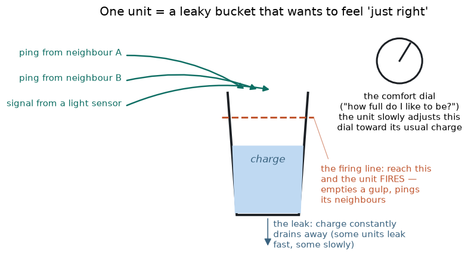

- It holds **charge** — think of water in a bucket.
- Charge **leaks** away constantly. Some units are built leaky (they
  forget fast), some hold charge longer.
- Charge pours in from two places: **pings** from neighbouring units, and
  signals from **sensors** (the machine's eyes).
- If the charge reaches the **firing line**, the unit *fires*: it dumps a
  gulp of charge and sends a ping of its own to every neighbour it is
  wired to.
- And — this is the whole idea of the project — the unit has a **comfort
  level**: an amount of charge it "likes" holding. Everything the unit
  ever learns, it learns by trying to stay near that comfort level.

There is no reward. No goal. No score. Nothing in the machine is told
what the outside world wants. Each unit just tries to feel *just right*,
forever.

### The two knobs a unit can turn

When a unit is uncomfortable — too full or too empty — it can adjust two
things:

1. **Its incoming wiring.** If it just got over-filled, it slightly
   weakens the connections from whichever neighbours just pinged it (and
   strengthens them if it was left too empty). How hard each surprise
   tugs the wiring is a setting we call the **learning speed**. This
   turns out to be the single most important dial in the whole machine.
2. **Its own comfort dial.** Instead of changing the world coming in, it
   can slowly change what it considers comfortable — "I guess this is
   fine now." How fast it resigns itself like this is a second setting
   (much slower than the first, normally).

That's it. That is the entire learning system. Here is the actual code
of one unit-step, lightly trimmed — you can see the three moves (leak,
fire, adjust) directly
([src/homeostasis/reservoir.py](../src/homeostasis/reservoir.py)):

```python
# 1. Charge leaks, and new charge pours in (pings + sensors).
x = self.x * (1.0 - c.leak) + self._spiked_f @ self.weights + inputs @ self.input_weights

# 2. Any unit at or above its firing line fires, dumping a gulp.
spiked = x >= thresholds
x_adj = x - spiked * thresholds

# 3. Discomfort = how far the remaining charge sits from the comfort level.
error = x_adj - self.targets
#    ...each unit tugs the wiring from whichever neighbours just pinged it,
#    scaled by the learning speed...
self.weights[prev_rows] -= self._adjacency_f[prev_rows] * per_weight
#    ...and nudges its own comfort dial, much more gently.
self.targets = np.maximum(self.targets + c.target_lr * error, c.target_floor)
```

### Wiring 200 of them into a "brain"

Take about two hundred of these buckets. Wire them to each other *at
random* — each connection exists or not by a coin flip, with random
strength. Plug a strip of sensors into some of them, again at random.
Pick a handful at random to act as muscles: when the "left" group fires
a lot, the machine turns left; the "right" group turns it right.

Nobody designs this wiring. Two machines built from different random
wirings can behave very differently — a fact that will come back to
haunt us later (we'll call it the **wiring lottery**).

The astonishing claim of the original research paper this project
rebuilds ([Falandays and colleagues, 2024](../README.md)) is that this
bag of comfort-seekers, dropped into a body, *behaves sensibly* — with
no reward and no goals. Our job was to find out **whether that's true,
when it's true, and why**.

---

## Part II — The worlds

We tested the machine in five worlds. Meet them first — every discovery
below happens in one of these.

### World 1: Follow the light

The machine stands at the centre of a circular room and can only *turn*.
A light crawls around the wall, reversing direction every so often. The
machine has a strip of 62 light sensors covering roughly the front
half of its view. Success = keeping the light in front of you.

Here is what its sensors actually report — a hill of activity centred
wherever the light is:

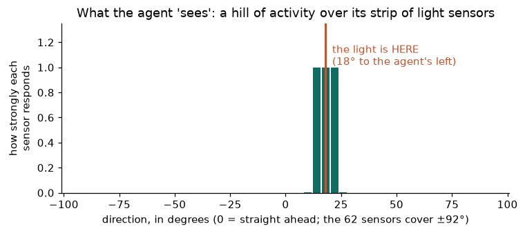

And here is a live run — the arena above, the sensor view below:

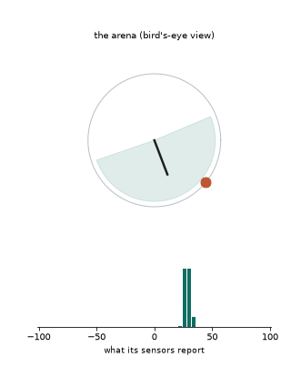

*By pure luck, you'd keep the light in front about 1 time in 4. A good
comfort-seeking machine manages it 60–100% of the time.*
**Watch it live:** `http://localhost:8471/lab/traj`

### World 2: Pong

A paddle that only moves up and down, a bouncing ball, sensors that
report the ball's direction. Success = hitting the ball back.

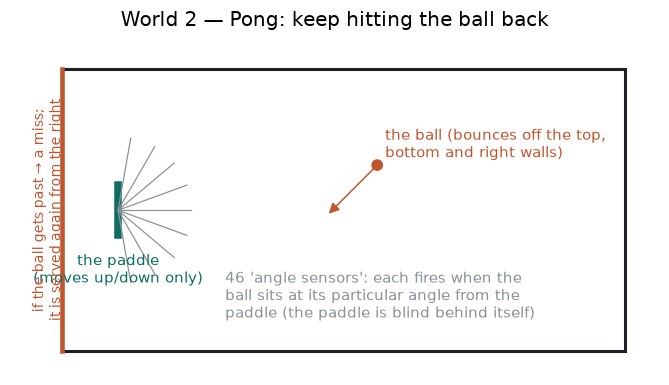

**Watch it live:** `http://localhost:8471/pong`

### World 3: Don't touch the walls

Now the machine gets a body that *drives* — two wheels, like a little
roomba — in a square room. Its only senses are two whiskers of light
that report "how close is the wall ahead-left / ahead-right?" Success =
cruising without bumping.

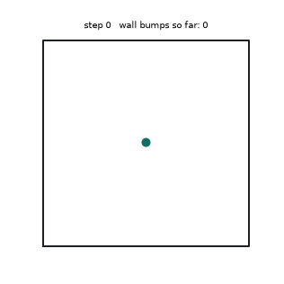

Notice what it settles into: a steady circle in open space, where its
senses report almost nothing. Keep that picture in mind — circles in
quiet places are this machine's favourite trick.
**Watch it live:** `http://localhost:8471/lab/wall`

### World 4: The chase

The driving body from World 3, the eyes from World 1, and now the light
*moves around the room* and must be chased. This is the hardest solo
world — success means staying close to a moving target.

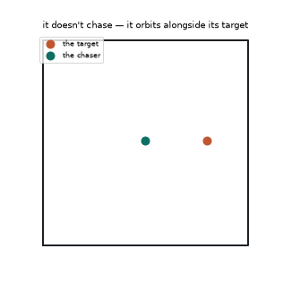

The chaser you're watching was not designed — it was *bred* (we kept the
best random machines and made mutated copies, over a few generations).
Look closely: **it never actually chases**. It circles alongside its
target, perfectly in step, like two skaters holding an invisible pole.
That observation becomes one of the big ideas below.
**Watch it live:** `http://localhost:8471/lab/pursuit`

### World 5: The shared arena

Finally: several machines in one big room, each able to see the others.
Can comfort-seekers form a society — follow each other, pay attention,
even reproduce? The animations for this one are further down, because
the answers need some setup.
**Watch it live:** `http://localhost:8471/lab/ecology3` and
`http://localhost:8471/lab/reproduce`

---

## Part III — What we found

We ran about 28,000 experiments across those worlds, always writing the
prediction down *before* running the test (so we couldn't fool
ourselves — the full ledger of 100 predictions, including all the wrong
ones, is in [scripts/lab/LEDGER.md](../scripts/lab/LEDGER.md)). Here is
the story that emerged.

### 1. It follows the light — but not the way you'd guess

You'd guess it works like a thermostat-guided missile: measure "the
light is 30° to my left," turn left proportionally. It does **not** do
that. We measured its response to being off-target, and there is
essentially none. Instead:

- It **matches the light's motion** — turning at the light's speed, like
  a surfer matching a wave, rather than aiming at a point. We call this
  **locking on** (a "lock" = moving in step with something). The
  technical write-ups call it *entrainment*; same thing.
- When it loses sight of the light entirely, it **freezes and waits** —
  and because the light circles the room, the light *comes back to it*.
  A machine that freezes when blind and surfs when seeing needs no aim
  at all. (We nicknamed the freeze a *ratchet*: it only ever advances or
  holds, never searches.)
- Weirdest of all: if you secretly **swap its left and right muscles**
  mid-run, it barely stumbles. A hard-wired aiming circuit would drive
  itself away from the target forever. The surfing scheme just re-locks
  a moment later.

So the machine's skill is not *knowing where the light is*. It is
*being draggable by moving light* — and freezing otherwise.

### 2. The most important dial: learning speed

Remember the learning speed — how hard each surprise tugs the wiring?
Watch the same brain design at three settings:

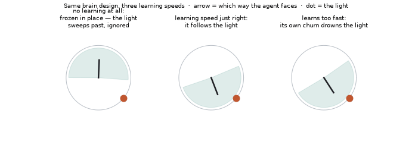

- **Too slow (left):** the machine never tames its overexcited starting
  wiring. It saturates, freezes, and ignores the world. We call this a
  **statue**.
- **Just right (middle):** it follows beautifully.
- **Too fast (right):** the wiring is being yanked around so violently
  by its own updates that the yanking drowns out the light. We call
  this constant self-generated commotion **churn**.

Mapping this carefully — 4,800 runs on a computing cluster — gives one
of the project's central pictures. For every **forgetting speed** (how
leaky the buckets are) there is a matching best **learning speed**, and
together they form a diagonal crest of good settings we call **the
ridge**:

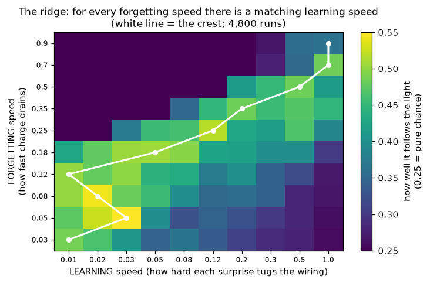

Here's the historical kicker: the original paper's own code fixed the
learning speed at the far-right column of this map — one of the worst
choices — and the entire published parameter search explored *up and
down that one column*. Changing that single number roughly **doubles**
the machine's tracking ability.

**Explore the map yourself:** `http://localhost:8471/lab/phase` — click
any cell to launch that exact machine live.

### 3. Three exact bookkeeping rules

Underneath everything, we proved the machine obeys three simple rules
*exactly* (not approximately — to the precision of the computer):

1. **The survival rule.** A unit stays "alive" (able to ever fire) only
   if its steady incoming charge beats its leak. Below that line it goes
   permanently silent.
2. **The busy-ness rule.** For a unit that does fire, *how often* it
   fires is completely fixed by just three numbers: its incoming charge,
   its comfort level, and its leak. No history, no personality — plug in
   the three numbers, out comes the firing rate.
3. **The auto-volume rule.** All the fiddly per-connection wiring
   adjustments add up, per unit, to something dead simple: the unit's
   *total* incoming connection strength gets turned down exactly in
   proportion to its discomfort — like an automatic volume knob seeking
   a set loudness.

These three rules let us do something unusual: **predict what a frozen
machine will do from its wiring file alone, without running it** — and
the prediction is perfect. You can play with rules 1 and 2 on a live
single unit at `http://localhost:8471/lab` (sliders for every knob).

### 4. Where is the habit stored? (the "bias carrier" question)

A machine that's currently following a leftward-moving light is carrying
a *habit*: "keep turning left." That habit must physically live
somewhere. We found it can live in **two different places**:

- in the **wiring strengths** (the connections have been tugged into a
  left-turning pattern), or
- in the **charge still sloshing around** (recent sensor input hasn't
  leaked away yet, and its echo keeps pushing left).

We call whichever place holds the habit the **bias carrier** ("bias" =
the current turning tendency). And we found the machine's *leakiness*
decides which place is used — that's what the phrase **"the bias carrier
regionalizes"** meant in the technical notes: *different regions of the
settings map store the habit in different places.* Leaky machines forget
their charge-echoes quickly, so their habit *must* be written into the
wiring; long-memory machines can just ride the echo. We measured this
across five leakiness settings and the storage location shifts exactly
as predicted.

### 5. Same signal, opposite meanings — the body decides

In World 1 (light-following), more sensor input correlates with success:
seeing lots of light means you're facing your target. In World 3
(wall-avoiding), it's the *opposite*: the sensors report wall
closeness, so a successful machine is one whose senses report almost
**nothing**. Internally the machine is identical in both — it's simply
seeking sensory *calm* it can absorb. Whether that calm means "facing
the prize" or "far from danger" is decided entirely by **what kind of
body and sensors you bolt on**. The machine has no idea which world it's
in, and doesn't need one.

The wall-world also has a darkly funny failure mode: it's the one world
**solvable by dying**. A machine that goes full statue never moves and
never hits a wall — a perfect score, from a corpse. (Every wall result
in this project checks for a pulse before counting the score.)

### 6. What can be chased? Three rules of chase-ability

Breeding chasers in World 4 against targets moving in different patterns
gave a crisp, three-part law of what these machines can and cannot
follow:

**Rule 1 — the path must be steerable with a steady hand.** A target
circling smoothly needs one constant turning effort to shadow — easy. A
target on a stretched oval needs constantly *varying* effort — and past
about twice the variation, breeding stops producing followers and starts
producing **toll-booths**: machines that just park at a good spot on the
target's route and let it drive past, collecting closeness points. (A
real evolved strategy. We checked: one champion "chaser" sat at speed
exactly zero.)

**Rule 2 — the target must move at a comfortable speed.** We measured
the whole comfort zone:

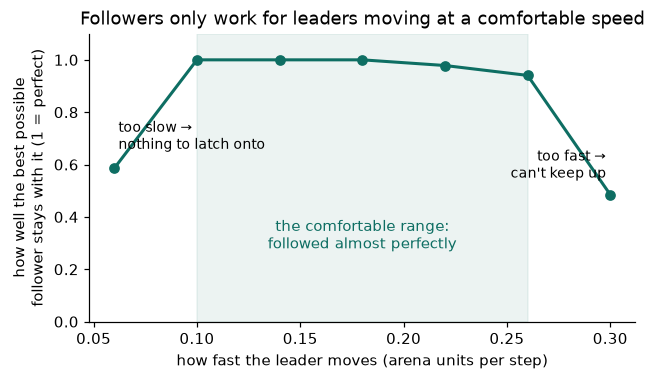

Too slow gives the surfer no wave; too fast outruns it.

**Rule 3 — each encounter must last long enough.** Locking on takes a
few hundred steps. We threw straight-flying targets across the arena
("catch the comet"): when crossings were *shorter* than lock-up time,
breeding produced something wonderful and damning — a champion that had
**evolved itself blind**. Its genes turned its own eyes down to nothing
and it just cruised, because eyes that can't finish locking are worth
nothing. Slow the comets down so each crossing outlasts lock-up, and
suddenly sighted machines catch more than half of them.

Two named ideas from the technical notes belong here:

> **"Looming ramp."** When something approaches you, what you see gets
> steadily bigger and brighter — a smooth swell that rises over time.
> That swell is what the machine can lock onto during an approach.
> Here's the real sensor data — a fly-past target versus a target
> milling about at middle distance:
>
> 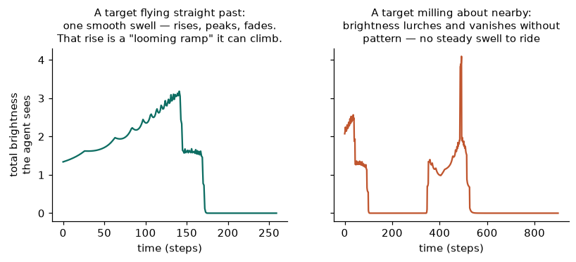

> **"Loitering harm."** Against a target that just mills about (no
> swell, no rhythm), having eyes is *worse than being blind*. We
> measured it: a blind machine that simply parks scores better, because
> the milling target frequently wanders past it. The sighted machine's
> flickering view revs it forward without steering it anywhere — it
> literally drives itself into the walls, away from where the target
> hangs out. Sight without something lockable isn't neutral; it's
> poison.

And the "catching a fly ball" intuition from our meetings? Confirmed,
with an asterisk: a fielder-style interception *is* purely within this
machine's powers — **but only because a fielder watches the ball
continuously from the moment it's hit.** One long encounter. Chop the
watching into short glimpses and no amount of cleverness in the wiring
rescues it.

### 7. Breaking it, and watching it heal

**Kill parts of its brain, mid-run.** We deleted 10–50% of a working
machine's units *while it ran*. The comfort-seeking wiring rule turns
out to double as a repair kit: surviving connections automatically
strengthen to make up for the lost input — the machine's activity
recovers on its own. (Biologists know this exact phenomenon in real
neurons as *synaptic scaling*; here it falls out of the comfort rule
with nothing added.) Two honest wrinkles: small injuries barely need
repairing — the machine has so much redundancy that a *frozen* brain
shrugs off 10% loss — and the repair process itself briefly makes
things worse, like inflammation.
**Watch a kill-and-recovery live:** `http://localhost:8471/lab/repair`

**Add sensor static.** A little random noise on the sensors *rescues*
the too-slow-learning statue machines — the static keeps their world
from ever going fully dark, which keeps the learning signal alive. (A
targeted trick, not a cure-all: the same static wrecks the delicate
locks of World 4's chasers.)

**Use fewer wires.** Machines wired at one-fifth the usual density were
the most *reliable* trackers we found. Reason: a sparse machine starts
life much closer to comfortable — there's simply less overexcited wiring
to tame — so even timid learning suffices, and the churn danger never
arises. (It's not that sparse wires carry information better — dense
wiring actually packs about ten times more information into each firing.
Sparseness wins on *stability*, not on eloquence.)

### 8. The comfort dial betrays you

Remember the unit's second knob — slowly moving its own comfort level
("I guess this is fine now")? Across nearly every test, **that knob is
the villain**:

- On the follow-the-light world, machines with the comfort dial *frozen
  from birth* end up far better over long runs. The dial slowly
  "makes peace" with exactly the wrong things, and the damage rides in
  the dial settings themselves — wipe them clean mid-run and the machine
  heals completely.
- On the wall world at gentle learning speeds, the dial is the actual
  *killer*: it's how statues happen (the unit re-labels its overload as
  "comfortable" instead of fixing it). Freeze the dial and every corpse
  in our test — 16 out of 16 — comes back to life.
- The one clean exception is a particular well-tuned machine from the
  original sweep, where early dial-adjustment genuinely helps — and even
  there the benefit is temporary.

Plain moral: **keep adjusting your wiring forever; stop adjusting your
standards early.**

### 9. The middle only exists while actively held

Here's the deepest single fact we found. Take any of these machines and
freeze *all* learning. Then ask: what activity level does it settle at?
Answer: **all-out or dead — never in between.** The in-between hum
(units firing 10–30% of the time) where every single competent behaviour
lives simply *does not exist* as a resting state. It exists only while
the comfort-seeking machinery actively holds the machine there, like a
pencil balanced on its tip by constant tiny corrections.

This one fact quietly explains half the campaign: why frozen machines
decay (their balance can't be re-caught after a stumble — the wiring
rule is the *re-catcher*), why the statue and the churner are the two
natural graves, and — wait for it — why reproduction is hard (§11).

### 10. Society: attention, seduction, and a conga line

Put a follower in a room with **two** things to watch and something
awful happens: it follows *neither*. Two moving lights blend into a
flickering mess with no steady wave to surf. It's not merely distracted
— a second light at one-tenth brightness already destroys the lock. The
machine has **no ability to pick out one thing from a scene**
(researchers call that missing power *figure-ground separation*, or
just attention).

Can it be fixed? We tried three attention schemes:

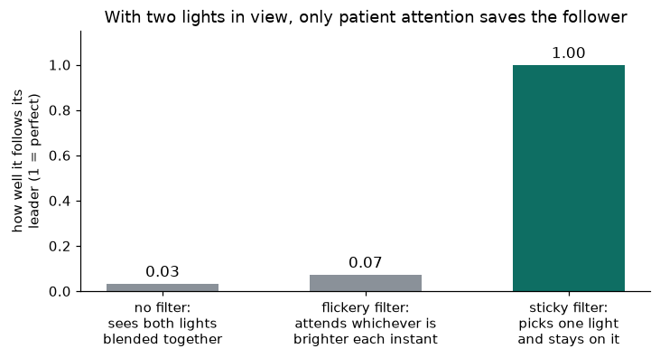

- Blending everything: fails.
- "Watch whatever is brightest right now": *also fails* — the choice
  flickers between lights, and the view teleports with every flicker.
- "Pick one and **stick with it** unless something else is much
  brighter for a long while": complete success. **One bit of
  stubbornness is the entire difference between a working society and
  none.**

With sticky attention installed, we built an actual society: a blind
wall-circler (it circles because of walls it avoids — it can't see
anyone) acts as a steady metronome, a follower locks onto *it*, a second
follower locks onto the first, and so on:

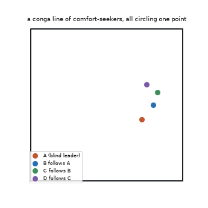

Each follower rides the one ahead like the light in World 1 — a rhythm
cascading down a line of comfort-seekers, everyone visible to everyone,
each politely watching only its own leader.

Two rich failure stories from this arena:

> **The seduction.** Make the attention rule only mildly stubborn and
> watch what happens: a follower creeps close behind its leader, becomes
> *the brightest thing in the leader's view* — and steals the leader's
> attention. The leader turns from the metronome to gaze at its own
> follower, and the pair wanders off together, lost. Salience-chasing
> attention flips who-follows-whom upside down; only patient attention
> keeps the hierarchy.
>
> 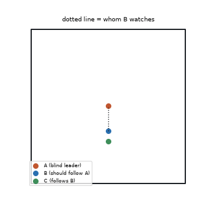

> **"Heavy-wheel repeater."** The conga line can't grow forever — each
> follower circles a bit *smaller and slower* than its leader, and
> around the fourth link the motion gets too slow to surf (Rule 2 from
> §6). We tried to build a signal-booster link — a follower with
> wide-set wheels, a body that physically *can't* jitter, hoping it
> would re-broadcast a cleaner rhythm, the way relay stations refresh a
> fading signal. It failed: the steady body was also too sluggish to
> execute the turns that staying locked requires. It smoothed away the
> noise *and* the signal. Four links deep is where the music stops.

### 11. Reproduction: you can't inherit a lock

Our mentors asked: what if these machines could reproduce? We let a
machine that had held its lock for a long while "give birth" — placing a
child right where it stands. Four experiments, one ladder:

1. Child gets the parent's *position* only (fresh random brain): child
   fails. (Random wiring loses the wiring lottery.)
2. Child also inherits the parent's *wiring layout*: still fails.
3. Child is a *perfect genetic clone*, standing exactly where its
   locked parent stands: **still fails.**
4. Child is *budded* — it receives a full copy of the parent's living
   state: every unit's current charge, comfort settings, connection
   strengths, mid-firing. **Total success** — each child locks
   instantly, earns its own child, and the family fills the room:

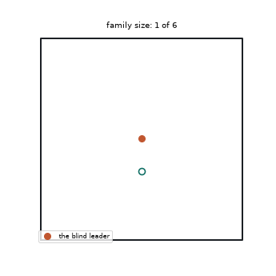

Why does only budding work? Because of §9: competence in this machine
family *is a held balance*, not a structure. A blueprint — even a
perfect one — specifies the pencil, not the balancing. **The heritable
unit is the entire living state.** Biology's answer to this exact
problem is everything it wraps around a genome — a womb, development,
parenting — machinery that *re-derives* the balanced state in the child.
That's precisely what this minimal family lacks, and now we can say so
with measurements.
**Run all four rungs yourself:** `http://localhost:8471/lab/reproduce`

By the way, the sticky-attention rule from §10 graduated into real,
tested project code — here is its entire decision, from
[src/homeostasis/attention.py](../src/homeostasis/attention.py):

```python
# Watch your current source. Count how long a rival has been much brighter.
if rival != self.selected and sums[rival] >= self.ratio * max(sums[self.selected], 1e-9):
    self._streak += 1
else:
    self._streak = 0          # rival dimmed even once? start the count over
if self._streak >= self.patience:
    self.selected = rival     # only then, switch
```

### 12. The three lotteries (an honest warning label)

Three separate kinds of luck run through everything above:

- **The wiring lottery.** Random wiring makes or breaks a machine, and
  nothing we tried can tell winners from losers *without running them*.
  Learning can't fix a losing ticket; only re-drawing (selection,
  breeding) can.
- **The wander.** Even a winning machine's performance drifts up and
  down over time — by a similar amount in *every* design we tested. The
  dips turn out to be moments of accidental blindness (the light slips
  out of view). Good designs don't wander less; they wander around a
  higher average.
- **The starting-position lottery.** *Getting* locked in the first
  place, from an arbitrary starting spot, succeeds maybe 1 time in 5 —
  and the lucky spots form a fine speckle, not a nice target zone: move
  a winning start by a hand's width and it usually fails, while a new
  winner appears somewhere else. You can't aim for a lock. You can only
  inherit one (budding), keep one (patience), or re-roll until one
  happens (evolution).

### The whole story in one paragraph

A pile of buckets that only want to feel *just right*, wired at random
into a body, will — at the right learning speed — organise itself to
surf whatever steady rhythm the world offers: a circling light, a
bouncing ball, a wall-free curve, a partner's orbit, a partner's
partner's orbit. It has no aim, no map, no goals; it freezes when the
world goes quiet and lets the world come back. Its powers are real
(following, self-repair, societies, even reproduction-by-budding) and
its limits are just as real (nothing jerky, nothing too fast or slow or
brief, no picking one thing from a crowd without a stubbornness bolted
on, no inheriting skill through any blueprint). And the deepest reason
for both the powers and the limits is the same: everything this machine
*is* exists only as a balance it is actively holding.

---

## Part IV — Play with it yourself

Start the viewer server (once):

```bash
.venv/bin/python -m uvicorn viz.server:app --port 8471
```

| Page | What you can do there |
|---|---|
| `http://localhost:8471/lab` | Poke a single unit with sliders — watch the survival and busy-ness rules happen live |
| `http://localhost:8471/lab/phase` | The learning-speed map — click any cell to launch that machine |
| `http://localhost:8471/lab/traj` | Watch a tracker live; swap its muscles; add sensor static |
| `http://localhost:8471/pong` | The Pong machine, live |
| `http://localhost:8471/lab/wall` | The wall world — teleport the settled agent and watch it drift home |
| `http://localhost:8471/lab/pursuit` | The bred pursuer, its failure modes, and comet-catching |
| `http://localhost:8471/lab/repair` | Delete part of a running brain; watch it heal (or not) |
| `http://localhost:8471/lab/ecology` | The first two-agent chain, live |
| `http://localhost:8471/lab/ecology3` | Three agents, all-seeing: try the four attention rules, reproduce the seduction |
| `http://localhost:8471/lab/reproduce` | The four-rung reproduction ladder, ending in budding |

Every picture and animation in this guide is generated from the real
simulation code by two scripts —
[scripts/lab/make_tour_assets.py](../scripts/lab/make_tour_assets.py)
and [scripts/lab/make_tour_gifs.py](../scripts/lab/make_tour_gifs.py) —
and the simulations are exactly repeatable: same code, same numbers,
same pictures, on any machine.

**Going deeper:** the expert-shorthand companion is
[docs/design_space.md](design_space.md) (all the numbers), and the
complete diary of all 100 predictions-then-results — including every
wrong prediction and every mistake we caught — is
[scripts/lab/LEDGER.md](../scripts/lab/LEDGER.md).

---

## Glossary

Plain meanings for every named idea, alphabetically.

- **Bias carrier** — wherever the machine's *current turning habit*
  physically lives: either in the wiring strengths or in the
  still-sloshing charge. "The bias carrier **regionalizes**" = which of
  the two places is used depends on the machine's settings (leaky
  machines must write the habit into wiring; long-memory machines ride
  the charge echo).
- **Budding** — reproduction by copying a parent's complete *living
  state* (all charge, comfort settings, wiring strengths), not just its
  blueprint. The only reproduction that works here.
- **Churn** — the constant self-generated commotion of a machine whose
  learning speed is too high; its own wiring updates drown out the
  world.
- **Comfort level / comfort dial** — the amount of charge a unit "likes"
  holding; the dial is the unit's ability to slowly change that
  standard. Mostly harmful (see §8).
- **Firing** — a unit dumping a gulp of charge and pinging its
  neighbours, when its charge reaches the firing line.
- **Forgetting speed (leak)** — how fast a unit's charge drains on its
  own.
- **Heavy-wheel repeater** — our failed attempt to extend the conga
  line: a follower with wide-set wheels that physically can't jitter,
  meant to re-broadcast a cleaner rhythm like a relay booster. Its
  steadiness also made it too sluggish to stay locked.
- **Learning speed** — how hard each surprise tugs a unit's incoming
  wiring. The most important dial in the machine.
- **Lock (locking on)** — moving in step with something (a light, a
  ball, another agent), like a surfer on a wave. The technical papers
  say *entrainment*.
- **Loitering harm** — against a target that mills about with no steady
  approach-swell, having eyes is *worse* than being blind-and-parked:
  sight revs the machine forward without steering it.
- **Looming ramp** — the steady swell in what you see as something
  approaches you head-on; the climbable signal that makes interception
  possible.
- **Ratchet** — the freeze-when-blind behaviour: hold still, let the
  periodic world bring the target back.
- **The ridge** — the diagonal crest of good settings pairing each
  forgetting speed with its matching learning speed.
- **Seduction (the)** — the society failure where a follower gets so
  close and bright that it steals its own leader's attention, inverting
  who-follows-whom.
- **Sensor static rescue** — a little random noise on the sensors saves
  too-slow-learning machines by keeping their world from ever going
  fully dark.
- **Statue** — a machine that has saturated and frozen: comfortable,
  motionless, dead to the world. The signature failure of too-slow
  learning and of the comfort dial.
- **Sticky attention** — pick one thing to watch and switch only if a
  rival is much brighter for a long while. One latched bit of
  stubbornness; the minimal working attention.
- **Three lotteries** — wiring (your random brain), wander (your good
  days and bad days), starting position (whether you ever lock at all).
- **Toll-booth** — a bred "chaser" that actually just parks where the
  target regularly passes, collecting closeness credit.
- **Wander** — the slow, universal drift of performance up and down over
  time; its dips are moments of accidental blindness.
- **Wiring lottery** — the make-or-break luck of the initial random
  wiring; unfixable by learning, only by re-drawing.
